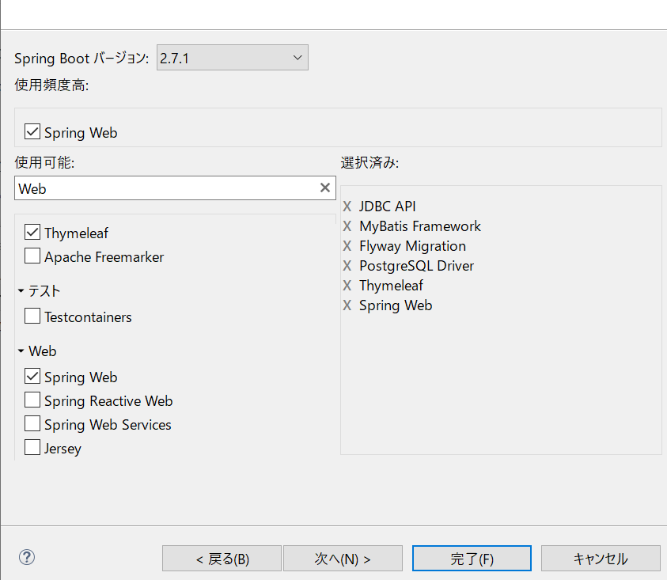

# SpringBoot入門
https://masahiroharada.github.io/spring-boot-primer/#%E7%9B%AE%E7%9A%84%E3%83%BB%E5%AF%BE%E8%B1%A1

# Postgresql
[説明書](https://www.postgresql.jp/document/13/html/index.html)

### 開発環境構築
この章では、開発に必要なソフトウェアのインストール方法を紹介します。

あらかじめ Java および PostgreSQL はインストールしておいてください。
- STS（Spring Tool Suite）
- Eclipseプラグイン
- データベースクライアント
- [Postgresql](https://www.enterprisedb.com/downloads/postgres-postgresql-downloads)

[pgAdmin4](https://works.forward-soft.co.jp/blog/detail/10118)

- [Emmet](https://design.nagomi-reha.com/emmet/)
https://zenn.dev/miz_dev/articles/6cac5f2e32398d

## WAFの仕組み
コードを書く前に WAF（Web Application Framework）について説明します。  

### フレームワークとは
EC サイトでも SNS でもニュースサイトでも求人サイトでも、Web アプリケーションに共通して必要な処理があります。
例えば…  
1. リクエスト URL に基づいて特定の処理をよびだす
2. ユーザーの認証を行う
3. 入力値のバリデーションを行う
4. データベースに接続する
5. テンプレートにデータを流し込みHTMLを生成する
6. レスポンスメッセージを作成する
などです。

これらの共通処理をまとめたプログラム群が Web アプリケーションフレームワークと呼ばれます。フレームワークが提供する共通処理部分を自前で書く必要がなくなるので生産性が高くなります。  

### WAF のパターン
WAF はプロダクトによってそれぞれ書き方やクラスの呼び名などが少しづつ違いますが、基本となるパターンは似ています。

1. アプリケーションが HTTP リクエストを受け取る。
2. リクエスト URL ごとの処理が実行される前に認証チェックなどの共通処理が実行される。この処理はたいてい「ミドルウェア」と呼ばれる。
3. リクエスト URL およびリクエストメソッドに従って、あらかじめ紐づけしておいたメソッドが実行される。
  1. 紐づけというのは例えば「GET で /profile がリクエストされた時は ProfileController の show メソッドを呼ぶ」という設定のこと。この紐づけ設定を「ルーティング」と呼ぶ。設定ファイルもしくはアノテーションで定義することが多い。また、ルーティング先のクラスのことを「コントローラー」と呼ぶ。
  2. 記で呼ばれたメソッド内の処理は要件次第だが、データベースを操作する際はたいてい「Object-Relational マッパー（後述）」が用いられる。
4. レスポンスを返却する際、コンテンツが HTML であれば HTML 生成のために「テンプレート（エンジン）」が用いられる。
このパターンを習得してしまえば今まで使ったことがなかったフレームワークもある程度スムーズに理解することができます。
  
### 様々な WAF
言語によっていくつかの WAF が開発されています。

機能は様々で、上記のパターンの機能すべてを装備したフレームワークもあれば、ルーティングの機能だけを備えたミニマルなフレームワークも存在します。

### 初期設定


- SQL
  - JDBC：データベースを操作する
  - MyBatis：OR マッパー（後述）
  - PostgreSQL：PostgreSQL に接続するため
  - Flyway：マイグレーション（後述）
- Template Engines
  - Thymeleaf：テンプレートエンジン（後述）
- Web
  - Web：ルーティングなど Web アプリの基本機能

### コントローラークラス
1. クラスに「@Controller」を付ける。
2. メソッドに「@GetMapping」「@PostMapping」を付けて リクエスト URL + HTTP メソッドを紐付ける。
というのが Spring におけるルーティングのパターンです。


### URL設計
|URL	|Method	|ContentType	|目的|
|---  |---    |---          |---|
|/	                  |GET	|HTML	|TOP 画面               |
|/create	            |GET	|HTML	|メンバー追加 画面      |
|/create	            |POST	|HTML	|メンバー追加 実行      |
|/api/members	        |GET	|JSON	|すべてのメンバーを返す  |
|/api/members/{words}	|GET	|JSON	|wordsでメンバーを検索  |

下の2つの`/api/〜`は、Ajax用でJSONをレスポンスします。

### DB マイグレーションとは
DBマイグレーションとは、テーブル定義を管理する仕組みのことです。  

アプリケーションを開発するにあたって、テーブル定義はしばしば変更されるものです。実装着手前の設計段階で変更のない完璧なテーブル定義を作成することは不可能です。初期フェーズの開発中においてさえ設計の変更（テーブルやカラムの追加）は発生しますし、リリースした後もアプリケーションの成長（＝機能追加、仕様変更）に合わせてテーブル定義も当然変化します。  
そこで、変遷するテーブル定義を管理する必要が出てきます。DB マイグレーションツールはたいてい、どのような SQL をどの順番で実行したかを管理します。そして実行される SQL 文[^1]はアプリケーションのプロジェクトディレクトリに含まれます。つまりアプリケーションコードと同様にバージョン管理下に置かれ共有されるということです。  
  
ある環境にアプリケーションをリリースするときやチームに新しいメンバーを迎えるとき、このようにテーブル定義の管理がされていると、データベースをあるべき状態に再現することが容易になります。  
[^1]: マイグレーションツールによっては SQL 文ではなく、独自のクラスや設定ファイルでテーブルの状態や変更を表現する場合もあります。  

### Flyway
DB マイグレーションを実現するためのライブラリはいくつかあるようですが、今回はその中で Flyway というライブラリを使用します。

### 設定
#### application.properties
最後の行の`spring.flyway.enabled`に`true`を指定します。

※データベース名、ユーザー名、パスワードを要確認
```java
spring.datasource.url=jdbc:postgresql://localhost:5432/spring-demo
spring.datasource.username=postgres
spring.datasource.password=postgres
spring.datasource.driverClassName=org.postgresql.Driver

spring.flyway.enabled=true
```

### SQL
`src/main/resources`の下に`db/migration`というディレクトリを作成してください。
そしてそのなかに`V1__Create_members.sql`というファイルを作成してください。Flyway の仕様としてこのファイル名が重要な意味を持つので注意しましょう。

```java
V{バージョン番号}__{任意の名前}.sql
```

[初期テーブル](初期設定テーブル.PNG)
